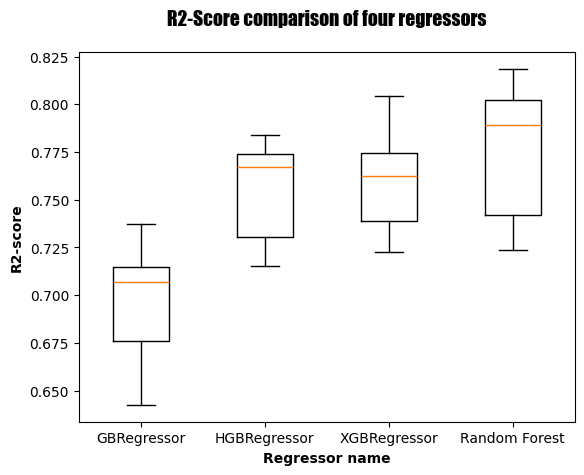

<h1 align="center"> Immo-Eliza-Estimator </h1>  

  

  A web application for individuals and real estate agents.

<!-- START doctoc generated TOC please keep comment here to allow auto update -->
<!-- DON'T EDIT THIS SECTION, INSTEAD RE-RUN doctoc TO UPDATE -->
## Table of Contents

- [Introduction](#introduction)
- [Description](#description)
- [Modeling](#modeling)
- [Deployment](#deployement)
- [Technology](#technology)
- [Acknowledgments](#acknowledgments)

<!-- END doctoc generated TOC please keep comment here to allow auto update -->

## Introduction

Price predictors are one of the main types of tools that can be designed with artificial intelligence and machine learning. As part of our training at BeCode, we had the opportunity to design such a model and deploy it as a web application.

Here we wish to share the results of this enriching and fruitful experience.

## Description

The project was organised in four phases:

1. Web scraping;
2. Data visualization;
3. Modeling (Machine learning);
4. Deployment.

The first phase consisted of scraping the website of the famous company [**immoweb**](https://www.immoweb.be/en) to create a relevant dataset of real estate properties in Belgium. The data collected were stored in a structured manner as a json file.

In the second phase of the project, the json file was conveted into a pandas DataFrame. The latter was then cleaned to perform an exploratory data analysis and to make insightful visualizations. This work allowed us to have a better understanding of the database and the field of real estate. So we were equipped for modeling.

The challenge of the third phase was to study different machine learning models, choose the best one for the situation, and trained it.

The aim of the fourth and final phase was to design and deploy a basic web application using the previously trained model.

In the following, we will detail the work carried out in the last two phases of the project.

## Modeling

The modeling phase started with a raw DataFrame consisting of 118 714 rows and 32 columns. Before the modeling itself, we have the following preprocessing operations.

1. **Data cleaning** (data validation, addressing missing data).

2. **Features engineering**:

    - *Lasso regression* for feature selection;

    - *ColumnTransformer*, *RobustScaler*, *OneHotEncoder* and *OrdinalEncoder* for feature transformation.

After the preprocessing step, we ended up with a dataset consisting of 56 307 records and 16 features plus the price (the target). We then tried multilinear regression, as well as other linear models such as Ridge and Lasso regressions. But, the *R2-score* did not exceed 0.5 and the *Mean Absolute Error* was above 150,000 euros. We then turned to scikit-learn **ensemble methods** and to **Extreme Gradient Boosting Regressor (XGBoost)**.

We used *cross-validation* without *hyperparameter tuning* to evaluate and compare the models. The diagram below provides an overview of the distribution of the R2-score of the following four models:

1. Gradient Boosting Regressor (GBRegressor);

2. Histogram Gradient Boosting Regressor (HGBRegressor); 

3. Extreme Gradient Boosting Regressor (XGBRegressor);

4. Random Forest Regressor (RFRegressor).

  

Each of these four models performs better than the linear models we tested. In the end, we focused on Histogram Gradient, Extreme Gradient, and Random Forest Regressors.

For each model, using **RandomizedSearchCV**, we performed a an hyper-parameter search with cross validation, and trained the model with the best parameters. The following table provides an overview of the performance metrics obtained.

|  | **HGB Regressor** | **XGB Regressor** | **RF Regressor** |
|--|-------------------|-------------------|------------------|
| R2-score (train) | 0.85 | 0.84 | 0.85 |
| R2-score (test)  | 0.75 | 0.75 | 0.75 |
| 95% Confindence interval of the score | [0.74, 0.75] | [0.74, 0.75] | [0.72, 0.74] |
| Mean Absolute Error | 53 224 € | 53 502 € | 53 392 € |
| Root Mean Squared Error | 75 744 € | 76 148 € | 76 120 € |
| Median Absolute Error | 36 270 € | 36 583 € | 36 798 € |

## Deployment

We used **streamlit** to design a web application based on one of the three models trained. The application itself was deployed on the [**render.com**](https://render.com/) platform at the following address:

[https://immo-eliza-estimator.onrender.com/](https://immo-eliza-estimator.onrender.com/)

## Technology

The main tools we used in this project are the following:

| python | pandas | numpy | scikit-learn | matplotlib | seaborn | streamlit |
|:------:|:------:|:------:|------|:------:|:------:|:------:|
|  |  |  | <a href="https://scikit-learn.org/" target="_blank" rel="noreferrer">  |  | </a>  | </a>  |

## Acknowledgments

All my thanks to my coaches at BeCode, Antoine and Denis, for the flawless coaching. Thank you also to my fellow trainees for their support and for the many sessions of mutual enrichment.